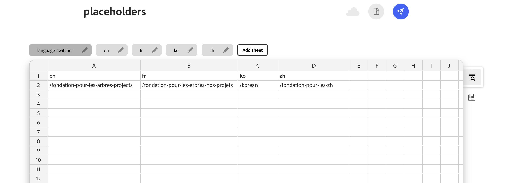

# Language Switcher


A Document Authoring (DA) library plugin that allows to quickly switch between localized versions of a page using **`placeholders.json`**. 


## Overview

Language Switcher is for same-page, different-language navigation. It helps authors jump to the equivalent path for the document they are editing.

## Features

1. **Automatic Locale Detection**
  * Detects the current language (like en, fr) directly from the page URL.
    This helps the plugin understand which version of the page you’re currently on.

2. **Smart Path Resolution**
  * Matches the current page path with entries in placeholders.json.
    Finds the correct equivalent page in the selected language automatically.

3. **Language Picker UI**
  * Provides a dropdown where users can select the target language. 
    Makes switching languages easy without editing URLs manually.

4. **Open Selected/All Languages**
  * Selected Langauge Page: Opens the same page in the language chosen by the user.
    All Language Pages: Opens all available language versions of the current page at once.

5. **Intelligent Fallback Navigation**
  * If no mapping is found in placeholders.json, the plugin falls back to updating only the locale in the URL while preserving the existing path.


## How to Use

1. Add the plugin under `tools/languageswitcher/` (`languageswitcher.html`, `languageswitcher.js`, `languageswitcher.css`, `placeholders.js`, `locale-url-helper.js`, optional `icons/`).
2. A published **`placeholders.json`** in repo that includes a **`language-switcher`** sheet. Example:




3. Open the page you want to switch from (any supported language) in DA
4. Open DA Language Switcher from the Library. 
5. Choose a language if the dropdown appears(for more than 2 languages). Choose one of the available actions:
  a) Open Page for Selected Language → Opens the equivalent page in the chosen language
  b) Open Page for All Languages → Opens all available localized versions of the current page
* For 2 languages the plugin directly displays the alternate language option instead of showing a dropdown.

## File Overview

```
tools/languageswitcher/
├── languageswitcher.html   # UI layout (entry point)
├── languageswitcher.js     # Core logic (UI + navigation handling)
├── languageswitcher.css    # Layout and styling
├── placeholders.js         # Fetch placeholders.json, Implements the core language resolution logic.
├── locale-url-helper.js    # Shared utilities (DA / preview URL builders, helpers) 
├── icons/
│   └── language-icon.svg   # library icon
└── README.md               # Documentation
```

### Configuration

> Site _CONFIG_ > _library_

| title | path | icon | experience |
| ----- | ---- | ---- | ---------- |
| `Language Switcher` | `/tools/languageswitcher/languageswitcher.html` | `https://main--<repo>--<org>.aem.page/tools/languageswitcher/icons/language-icon.svg` | `dialog` |

## Points To Note:

**Placeholder Resolution Priority:**
When multiple placeholders.json files are available across directory levels, the plugin prioritizes the root-level placeholder configuration.
